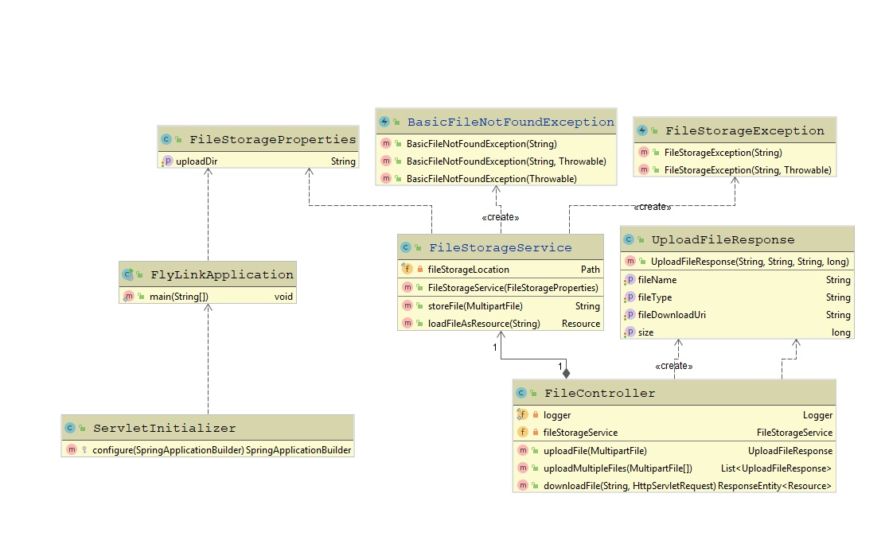
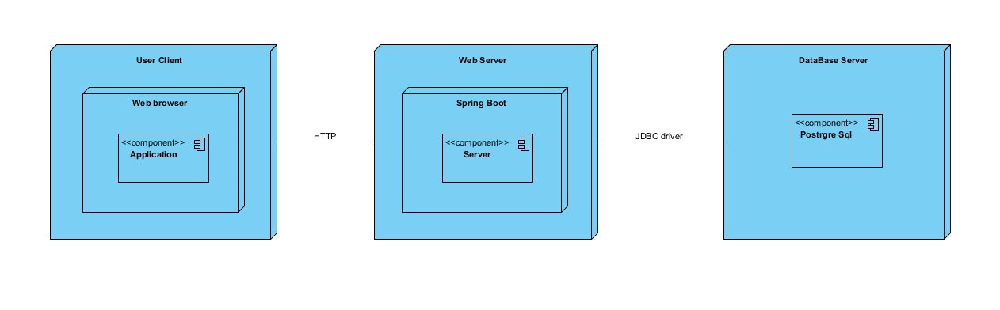
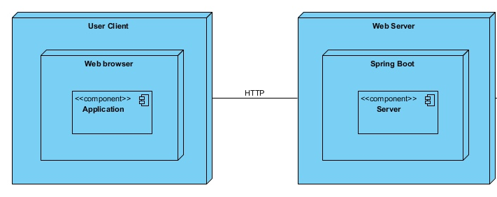

### Тип приложения 
Веб-приложение для выполнения преимущественно на сервере в сценариях с постоянным подключением
Распределенное развертывание – необходимо обеспечить безопасность и масштабирование.
### Атрибуты качества:
1. Эффективная работа приложения - обработка исключений, чтобы сократить количество сбоев приложений, приводящих к потере работоспособности системы.
2. Удобство рабоыт пользователя – разработка интуитивно понятного интерфейса. Написание документации, описывающей структуру приложения. 
3. Безопасность - создание сложного пароля, разделение возможностей авторизированных и неавторизированных пользователей.
4. Взаимодействие с пользователем /удобство и простота использования – не более трех действий для выполнения задачи пользователя (отравить файл на сервер).
### Решение о путях реализации сквозной функциональности:
1.Подход к реализации связей, используемый для обеспечения обмена информацией между слоями.
2.Инфраструктура управления исключениями, которая будет функционировать в каждом слое и между уровнями, если исключения распространяются в рамках системы. 
#### Диаграмма классов

##### Диаграмма компонентов

##### Диаграмма развертывания

##### Диаграмма развертывания ToBe

### Отличия
Отличия "As is" и "To be": На данном этапе реализован только функционал серверной части. Это было сделано основываясь на принцип "Минимизируйте проектирование наперёд",
так как реализация клиента и базы данных пока не требовалась. Функционал клиента и базы данных будут реализованы в финальном спринте. 
При реализации приложения был использован принцип "Единственности ответственности": за каждую совокупность функций отвечает свой отдельный класс.
Примером применения данного принципа является наша диаграмма классов.