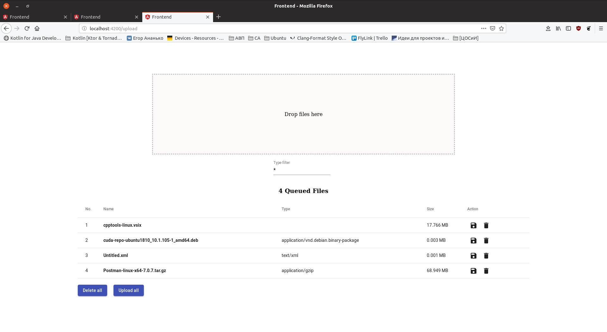
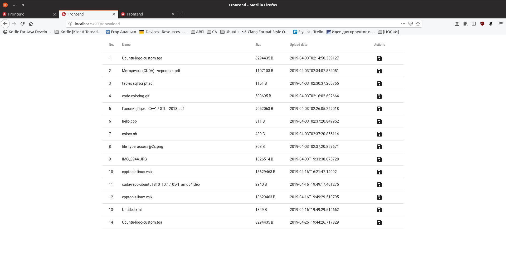
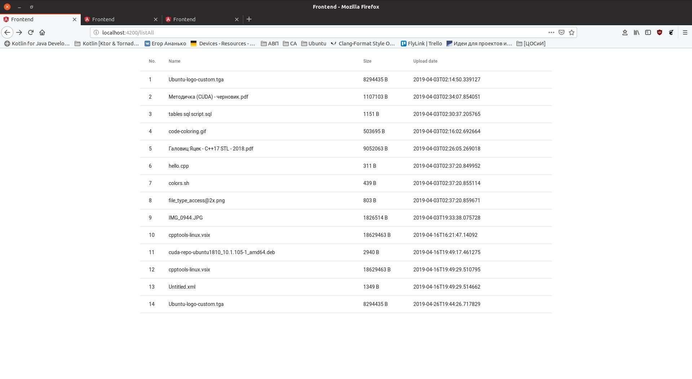

## Оценка разрабатываемого продукта

* Распознавание соответствия   
Приложение расчитано для предоставления возможности обмена файлами наиболее простым и удобным способом. 
Целью приложения являются: самоудовлетворение и возможность использовать приложение "для себя"  
Наши пользователи - люди, которые хотят максимально просто расшарить свой файл.  
Мы поможем пользователям автоматическое удаление файла, через время, установленное пользователем.

* Обучаемость  
В целом, разобраться в системе новому пользователю будет не трудно. Каждая страница имеет определенный тематический набор функций. Эти функции выполняют простые сценарии: загрузка, скачивание, удаление файла с сервера. Но стоит отметить, что у людей могут возникнуть вопросы о взаимодействии страниц приложения между собой

* Используемость 
При разработке дизайна использовался современный фреймворк, поэтому интерфейс выглядит привычным и интуитивно понятным. Кнопки подкреплены соответствующими иконками, облегчающими взаимодействие с интерфейсом. Сценарии действий спроектированы по типу: не более трех кликов для решения задачи.

* Защита от ошибок пользователя 
В приложении реализованы валидация форм и наличие подсказок при некорректном вводе, а также выбор файлов по конкретному типу.

* Эстетика графического интерфейса 
Как уже было отмечено, при разработке дизайна использовался современный фреймворк. Это позволило создать сразу приятный и интуитивно понятный интерфейс. Можно с уверенностью сказать, что приложение выглядит по всем современным принципам.

* Доступность 
Для использования приложения не требуется никаких определенных знаний, чтобы полноценно использовать приложение.

## Пути улучшения UX
* Добавить фильтр по типу файла  
* Добавить конпки для перехода по страницам(просмотр всех скачанных файлов и т.д.)  
* Добавить поле для ввода времени(для файлов с временным хранением)  

## UX на данный момент:

